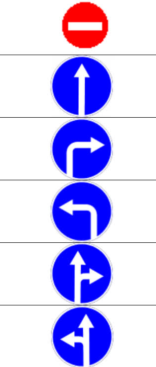

# road-sign-recognition

## Overview

I have written this script for robotech competition (RoboFest AutoNet 18+).
This was my first time working with computer vision. I took OpenCV library and
Python and I had no real knowledge what to do. A simple algorithm presented in
this repository is capable of recognizing a limited set of predefined road
signs. I use circle detection and orient on dominant color of zones.

I publish it here and hope it would be useful for someone, like a quick start
learning computer vision.

You can see script in action at YT: https://youtu.be/n4QAYV8Q2rs

## Warning

This is not the way real computer vision works, but just a simple script which
recognizes predefined images only.

#### List of images

